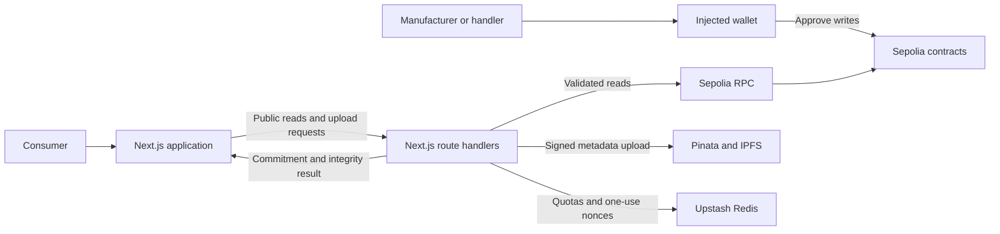

<h1 align="center">VerifyChain</h1>

<p align="center"><strong>Know the record. Make your own judgment.</strong></p>
<p align="center">Evidence-first product passports on Ethereum Sepolia.</p>

<p align="center">
  <a href="https://verifychain-murex.vercel.app">Explore the website</a> ·
  <a href="#product-intro">Watch the intro</a> ·
  <a href="#quick-start">Run locally</a> ·
  <a href="docs/RELEASE_HANDOFF.md">Release guide</a>
</p>

[](https://github.com/Kartik2004sharma/VerifyChain/actions/workflows/quality.yml)


VerifyChain connects a product ID or QR label to its registration, metadata commitment, manufacturer address, and recorded supply-chain activity. Consumers can inspect the public passport without connecting a wallet. Manufacturers and authorized handlers use explicit wallet approvals to write records.

**A registration is evidence of a recorded claim. It does not certify a brand, authenticate a physical item, or prevent someone from copying a QR label.**

## Product intro

https://github.com/user-attachments/assets/87f9a80a-735d-4f73-9c0f-ff655a58f55c

**23 seconds · 1080p · sound included.** The walkthrough shows the published website and an actual metadata-review interaction using clearly labeled sample input. It does not show a completed upload or blockchain transaction.

[Download the video](docs/media/verifychain-intro.mp4) · [Preview image](docs/media/verifychain-intro-poster.jpg) · [Media credits](docs/media/README.md)

## Release status

The website is published at **[verifychain-murex.vercel.app](https://verifychain-murex.vercel.app)**. The current release is a Sepolia preview with live integrations pending.

| Area                                 | Current state                                                                                                |
| ------------------------------------ | ------------------------------------------------------------------------------------------------------------ |
| Website and application UI           | Published on Vercel; public hosted browser checks recorded on 8 October 2026                                 |
| Local application and contract tests | Passing in the dated release evidence below                                                                  |
| Active Sepolia contracts             | Awaiting a new deployment of the repaired source; the active manifest has no addresses                       |
| Live verification and writes         | Unavailable until the RPC, matching contracts, Redis quotas, and Pinata storage are configured and validated |
| Public-chain acceptance              | Blocked until actual registration and checkpoint receipts, matching metadata, and device checks are recorded |

The application shows unavailable states and disables writes when dependencies are missing. Archived addresses are preserved as historical evidence and are not used as a fallback. See the [active manifest](deployments/manifest.json), [53 acceptance requirements](docs/QA_ACCEPTANCE_MATRIX.md), and [implementation ledger](docs/IMPLEMENTATION_PROGRESS.md).

## What you can build with it

| Workflow                  | Implemented behavior                                                                                                                                                         | Entry point                                                            |
| ------------------------- | ---------------------------------------------------------------------------------------------------------------------------------------------------------------------------- | ---------------------------------------------------------------------- |
| Public product passport   | Look up an ID or scan a same-origin QR label; inspect registration, revocation, metadata integrity, and chain context                                                        | `/verify`                                                              |
| Manufacturer registration | Register a company name from an injected wallet; identity remains explicitly self-registered                                                                                 | `/dashboard/register-manufacturer`                                     |
| Product registration      | Enter details, review canonical bytes and hash, authorize metadata upload, simulate the contract call, approve the transaction, and generate a QR label after receipt checks | `/dashboard/register-product`                                          |
| Supply-chain checkpoints  | Inspect typed checkpoints and let globally authorized handlers record activity                                                                                               | `/dashboard/supply-chain`                                              |
| History and analytics     | Filter and paginate up to the latest 100 wallet-submitted opinions for an entered ID; export escaped CSV                                                                     | `/dashboard/verification-history`, `/dashboard/verification-analytics` |
| Wallet overview           | Inspect up to the latest 100 registrations returned for the connected wallet                                                                                                 | `/dashboard`                                                           |
| Evidence and preferences  | Export available passport evidence as JSON, CSV, or PDF; save device-local theme and spacing preferences                                                                     | Passport results, `/dashboard/settings`                                |

These workflows are implemented in source; live-dependent steps require the services listed above. Legacy `/dashboard/verify-product?id=…` links remain supported. Read-only lookups do not submit observation transactions.

### From product details to a passport

1. **Prepare:** normalize the product fields into the `verifychain.product.v1` schema.
2. **Review:** inspect the exact canonical JSON and its Keccak-256 commitment before authorizing storage.
3. **Register:** sign the upload challenge, store metadata through the server, simulate the write, and approve it in the wallet.
4. **Inspect:** confirm the expected receipt/event after two confirmations, then open or download the public QR label.

Rejected signatures, wrong networks, reverted calls, and unresolved receipts have explicit states. An uncertain transaction is reconciled by its hash before another attempt.

## Architecture



The diagram describes the intended configured runtime. RPC, storage, and contract availability remain subject to the release status above.

| Layer                      | Technology and responsibility                                                           |
| -------------------------- | --------------------------------------------------------------------------------------- |
| Application                | Next.js 15 App Router, React 19, strict TypeScript, responsive CSS, Lucide icons        |
| Wallet and chain           | wagmi, viem, and TanStack Query; one shared wallet state across workspace navigation    |
| Input and evidence         | Zod validation, canonical JSON, Keccak-256 commitments, QR labels, JSON/CSV/PDF exports |
| Contracts                  | Solidity 0.8.20, OpenZeppelin, and Hardhat                                              |
| Storage and abuse controls | Server-side Pinata JSON pinning and shared Upstash Redis quotas                         |
| Verification               | Vitest, Hardhat tests, local-chain integration, Playwright, axe, and Lighthouse CI      |
| Hosting                    | Vercel for the Next.js application; GitHub Actions for independent quality gates        |

### Contract boundaries

| Contract                                                   | Responsibility                                                                                             |
| ---------------------------------------------------------- | ---------------------------------------------------------------------------------------------------------- |
| [ProductRegistry](contracts/ProductRegistry.sol)           | Manufacturer registrations, product commitments, authorized metadata updates, and revocation               |
| [VerificationRegistry](contracts/VerificationRegistry.sol) | Wallet-submitted observations and aggregate statistics; opinions are not physical verification             |
| [SupplyChainTracker](contracts/SupplyChainTracker.sol)     | Authorized handler checkpoints and supply-chain state; handler permission is global, not exclusive custody |

`CounterfeitReporter` is quarantined and excluded from both the deploy script and the UI. Its source changes are not an independently audited financial product. Old immutable deployments do not inherit source repairs.

## Quick start

Use **Node.js 24.19.0** from [`.nvmrc`](.nvmrc), **npm 11**, and the committed `package-lock.json`.

```sh
git clone https://github.com/Kartik2004sharma/VerifyChain.git
cd VerifyChain
npm ci
cp .env.example .env.local
npm run dev
```

Open **[localhost:3000](http://localhost:3000)**. The interface and metadata review can be explored before live services are configured. Product lookups and wallet writes remain unavailable until the environment and deployment manifest validate; no runtime sample-data fallback is enabled.

### Environment configuration

Configure values privately in `.env.local`. For Vercel, configure Preview and Production separately and set `APP_ORIGIN` to the exact origin being reviewed.

| Variable                                                           | Scope           | Purpose                                                                                   |
| ------------------------------------------------------------------ | --------------- | ----------------------------------------------------------------------------------------- |
| `APP_ORIGIN`                                                       | Server          | Exact origin authorized to request upload challenges; no trailing slash                   |
| `SEPOLIA_RPC_URL`                                                  | Server          | Dedicated HTTPS RPC for chain identity, deployed code, and contract reads                 |
| `PINATA_JWT`                                                       | Server          | JSON metadata pinning; never exposed to the browser                                       |
| `UPLOAD_AUTH_SECRET`                                               | Server          | At least 32 random characters for upload challenge integrity                              |
| `UPSTASH_REDIS_REST_URL`                                           | Server          | HTTPS shared quota and nonce store; required in production                                |
| `UPSTASH_REDIS_REST_TOKEN`                                         | Server          | Authentication for the shared quota store                                                 |
| `NEXT_PUBLIC_SEPOLIA_RPC_URL`                                      | Browser, public | Read and simulation RPC; restrict provider origins because browser credentials are public |
| `RELEASE_ORIGIN`, `RELEASE_PRODUCT_ID`, `RELEASE_TRANSACTION_HASH` | Release checks  | Actual hosted origin and user-approved registration evidence                              |

Deployment-only credentials are documented in [`.env.contracts.example`](.env.contracts.example). Keep the deployer's private key local; never add it to Vercel, browser variables, source control, or chat. Environment files are ignored by Git.

## Verification

```sh
# Lint, strict types, unit/API tests, Solidity tests,
# isolated local-chain integration, and production build
npm run check

# Regenerate the reviewed contract interfaces
npm run abi:export

# Browser, visual, and accessibility checks against a production build
npx playwright install chromium webkit
npm run test:e2e
```

The browser runner starts its own production server on port **3100**. Run `npm run build` first if you have not run `npm run check`. Set `E2E_BASE_URL` to test a reviewed hosted deployment instead.

**Recorded release snapshot — 8 October 2026:**

| Check                                               | Recorded result                                                     |
| --------------------------------------------------- | ------------------------------------------------------------------- |
| Clean install, lint, strict types, production build | Passed                                                              |
| Unit and API tests                                  | 42 passed                                                           |
| Solidity tests                                      | 20 passed                                                           |
| Real isolated local-chain integration               | 5 passed                                                            |
| Public hosted browser checks                        | 134 passed, 0 failed; 6 duplicate visual cases deliberately skipped |
| Reviewed visual images                              | 42                                                                  |
| Mobile Lighthouse median, three runs                | 99 performance / 100 accessibility / 100 best practices / 100 SEO   |
| Desktop Lighthouse median, three runs               | 100 / 100 / 100 / 100                                               |
| Acceptance ledger, 53 requirements                  | 30 scoped passes / 21 partial / 2 blocked                           |

Evidence: [publication summary](docs/audit-evidence/release-2026-10-08/publication-summary.json), [independent CI run](https://github.com/Kartik2004sharma/VerifyChain/actions/runs/37814803951), and [implementation ledger](docs/IMPLEMENTATION_PROGRESS.md). These are dated results, not a claim that every future checkout passes unchanged.

Most verdict browser tests intentionally replace HTTP responses. The integration runner deploys real contracts to an isolated local chain using Sepolia's numeric chain ID to exercise the selected-chain boundary; this does not constitute a public Sepolia deployment. Visual baselines use pinned Chromium and require review before intentional updates. Automated accessibility checks supplement real keyboard, screen-reader, zoom, and device review.

## Trust, privacy, and security

- **Separate evidence fields:** registration state, metadata integrity, manufacturer activity, and submitted opinions stay distinct. Verdicts are `registered`, `revoked`, `not_found`, `integrity_mismatch`, `unavailable`, and `invalid_input`.
- **Exact metadata commitments:** fixed field order, normalized strings, and whitespace-free UTF-8 JSON produce the committed hash. Retrieved metadata must validate and agree with the recorded product ID, name, and commitment. Source v2 updates URI and hash together; previous commitments remain reserved, and updates do not undo revocation.
- **Fresh chain reads:** each request uses a current block snapshot with no public verdict cache. Known registration evidence is scoped to its recorded block and indexed ID topic; unresolved optional receipts remain unavailable. There is no persistent event index.
- **Scoped uploads:** origin-, chain-, and address-bound signed challenges expire after five minutes. Redis atomically consumes each nonce once; request bodies, timeouts, response sizes, and per-wallet quotas are bounded. Development-only in-memory quotas are never used in production.
- **Controlled network boundaries:** metadata retrieval accepts fixed IPFS gateways with CID-like payloads instead of arbitrary contract-supplied HTTP URLs. Production scripts use per-request CSP nonces without an inline-script bypass or eval; inline styles remain allowed for theme, QR, and scanner libraries. RPC connections use the configured HTTPS origin.
- **Public records, private camera:** uploaded metadata and on-chain records are public. Camera frames stay on-device. Enter no personal or confidential content in product metadata.

Wallet support covers detected injected EIP-1193 providers. WalletConnect, mobile wallet deep links, mainnet, brand certification, image/file uploads, billing, and financial reporting are outside the current UI. Production client quotas trust Vercel's platform-managed forwarding header; other hosts use a conservative global bucket until a trusted proxy adapter is implemented. External alerting is not configured. This project has not received an independent security audit; remaining dependency decisions are documented in the [dependency review](docs/DEPENDENCY_REVIEW.md).

## Deployment and operations

The published site uses Vercel with **Node 24**, `npm ci`, and `npm run build`. Publishing the interface does not activate the contracts or storage services.

1. Review the repaired source, contract policy, acceptance ledger, and deployment credentials.
2. Deploy `ProductRegistry`, `VerificationRegistry`, and `SupplyChainTracker` to Sepolia with `scripts/deploy.cjs`. Preserve its deployment journal and reconcile any submitted hashes before retrying an interrupted run.
3. Review the real receipts and activate the matching deployment history with `scripts/activate-manifest.mjs`. Activation validates source/ABI/code identity and receipts before updating the manifest. Archive the previous manifest and rebuild afterward.
4. Configure the RPC, Pinata, upload authorization secret, Redis, and exact application origin in Vercel.
5. Record real user-approved manufacturer/product and checkpoint transactions, verify retrievable matching metadata, and test the printed label and camera on an HTTPS mobile device.
6. Run the release gate with the configured evidence and review the results before promotion.

```sh
# Load private local environment values for the standalone release checker
node --env-file=.env.local scripts/release-check.mjs
```

The checker requires a verified HTTPS `RELEASE_ORIGIN`, a real `RELEASE_PRODUCT_ID`, and a user-approved `RELEASE_TRANSACTION_HASH`, along with a valid manifest and server RPC. Missing evidence exits nonzero. `npm run release:check` runs the same checker when the variables are already set in the calling environment.

| Endpoint                                           | Purpose                                                                                                        |
| -------------------------------------------------- | -------------------------------------------------------------------------------------------------------------- |
| `GET /api/health/live`                             | Application liveness                                                                                           |
| `GET /api/health/ready`                            | Validated deployment manifest, reachable Sepolia RPC, and shared quota readiness; returns 503 when unavailable |
| `POST /api/blockchain/verify`                      | Public product passport lookup from a `productId` JSON field                                                   |
| `POST /api/metadata/challenge`                     | Origin-bound signed upload challenge                                                                           |
| `POST /api/metadata/upload`                        | Authorized, bounded canonical metadata upload                                                                  |
| `GET /api/products`, `/api/history`, `/api/supply` | Scoped product, observation, and checkpoint reads                                                              |

Roll back the website to a known-good hosted revision with its reviewed environment and manifest. A hosting rollback cannot undo blockchain writes. Contract replacement needs a versioned manifest and a compatibility/migration review. Follow the [release handoff](docs/RELEASE_HANDOFF.md) for the full operational boundaries.

## Repository guide

```text
app/                  Pages, layouts, and server API routes
components/           Passport, wallet, registration, scanner, and workspace UI
lib/domain/           Metadata schema, canonical hashing, verdicts, and QR parsing
lib/server/           Chain reads, configuration, quotas, and upload authorization
lib/contracts/        Exported ABIs and source identity
contracts/            Solidity source, including quarantined research contracts
deployments/          Active manifest and historical deployment evidence
scripts/              Deployment, manifest activation, ABI export, and release checks
tests/                Unit/API, browser/visual, and local-chain integration tests
test/                 Solidity contract tests
docs/                 Audit, design decisions, acceptance ledger, and release evidence
docs/media/           Intro video, poster, and attribution
```

| Document                                                                      | Read it for                                              |
| ----------------------------------------------------------------------------- | -------------------------------------------------------- |
| [Project audit](docs/PROJECT_AUDIT.md)                                        | Original gaps, risks, and source-grounded findings       |
| [Implementation progress](docs/IMPLEMENTATION_PROGRESS.md)                    | Requirement-by-requirement results and unresolved work   |
| [Acceptance matrix](docs/QA_ACCEPTANCE_MATRIX.md)                             | All 53 observable requirements and evidence expectations |
| [UI redesign](docs/UI_REDESIGN.md) and [visual review](docs/VISUAL_REVIEW.md) | Interface decisions and visual verification              |
| [Dependency review](docs/DEPENDENCY_REVIEW.md)                                | Advisory findings and compatibility decisions            |
| [Release handoff](docs/RELEASE_HANDOFF.md)                                    | Live-service configuration, deployment, and rollback     |
| [Master build prompt](docs/VERIFYCHAIN_MASTER_BUILD_PROMPT.md)                | The original implementation and acceptance contract      |

## Contributing and credits

Keep changes focused, describe the behavior they affect, and run the relevant checks. Never weaken an acceptance requirement or regenerate visual baselines merely to hide a failure. For security concerns, contact the maintainer privately and keep credentials and exploit details out of public issues.

Built by **[Kartik Sharma](https://github.com/Kartik2004sharma)**. A repository license has not yet been specified; the video's third-party music and sound effects have separate [credits and license terms](docs/media/README.md).
